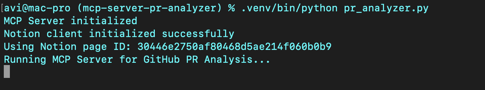

# mcp-server-pr-analyzer

## Project Overview: PR Review Server

A small utility to analyze GitHub pull requests for the MCP server project. This repository contains starter tooling to fetch and evaluate PRs, plus a simple example analyzer.

Here’s a concise breakdown of the pipeline:

1. Environment setup: Load the GitHub and Notion credentials.
2. Server initialization: Start an MCP server to communicate with Claude Desktop.
3. Fetching PR data: Retrieve the PR changes and metadata from GitHub.
4. Code analysis: Claude Desktop directly analyzes code changes (no separate tool needed).
5. Notion documentation: Save the analysis results to Notion for tracking.


## Step 1: Setting Up the Environment

Before we begin, ensure you have Python 3.10+ installed. Then, we set up our environment and start with installing the uv package manager. For Mac or Linux: 

```bash
curl -LsSf https://astral.sh/uv/install.sh | sh  # Mac/Linux
```

Then, we create a new project directory and initialize it with uv:

```bash
uv init pr_reviewer
cd pr_reviewer
```

We can now create and activate a virtual environment. For Mac or Linux:

```bash
uv venv
source .venv/bin/activate
```

Now we install the required dependencies:

```bash
uv add "mcp[cli]" requests python-dotenv notion-client
```

## Step 2: Install Dependencies

Create a requirements.txt file and add the following Python packages to it:

```bash
# Core dependencies for PR Analyzer
requests>=2.31.0          # For GitHub API calls
python-dotenv>=1.0.0      # For environment variables
mcp[cli]>=1.4.0          # For MCP server functionality
notion-client>=2.3.0      # For Notion integration

# Optional: Pin versions for stability
# requests==2.31.0
# python-dotenv==1.0.0
# mcp[cli]==1.4.0
# notion-client==2.3.0
```

The requirements.txt file contains all the core dependencies required for the project. To set up the dependencies, run either of the following commands (use uv if you’ve installed it earlier).

```bash
uv pip install -r requirements.txt
```

## Step 3: Setting Up the Environment Variables

Now, create a .env file and add the following text along with the API keys and token.

```bash
GITHUB_TOKEN=your_github_token
NOTION_API_KEY=your_notion_api_key
NOTION_PAGE_ID=your_notion_page_id
```

## Step 4: Integrate Claude Desktop application with MCP Server

Update your Claude Desktop config 
Edit `~/Library/Application Support/Claude/claude_desktop_config.json`:

```json
{
  "mcpServers": {
    "pr-analyzer": {
      "command": "/Users/avi/ai-projects/mcp-server-pr-analyzer/.venv/bin/python",
      "args": [
        "/Users/avi/ai-projects/mcp-server-pr-analyzer/pr_analyzer.py"
      ]
    }
  }
}
```

## Step 5: Run the MCP Server

Now that we have all the code pieces in place, we run our server with the following terminal command:

```bash
chmod +x /Users/avi/ai-projects/mcp-server-pr-analyzer/pr_analyzer.py
cd /Users/avi/ai-projects/mcp-server-pr-analyzer
.venv/bin/python pr_analyzer.py
```



Now, pass the link to the PR you want to analyze and Claude will do the rest of the things for you.
Claude will first analyze the PR and then provide a summary and review of it. 
Next, ask agent to upload the details to the Notion page.


## Development notes

- `pr_analyzer.py` is intentionally small — extend `PRAnalyzer.analyze()` to implement checks you want (linting, changelog presence, size limits, label rules, etc.).
- Use `github.py` helpers to fetch PR metadata and files. Consider using PyGitHub or the GitHub REST API directly.

